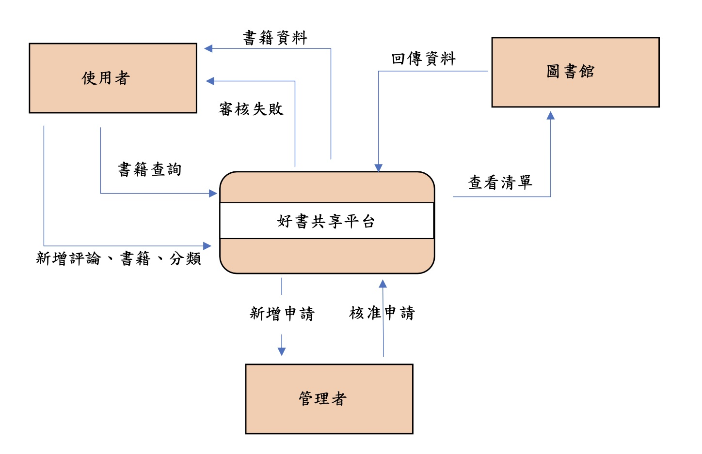
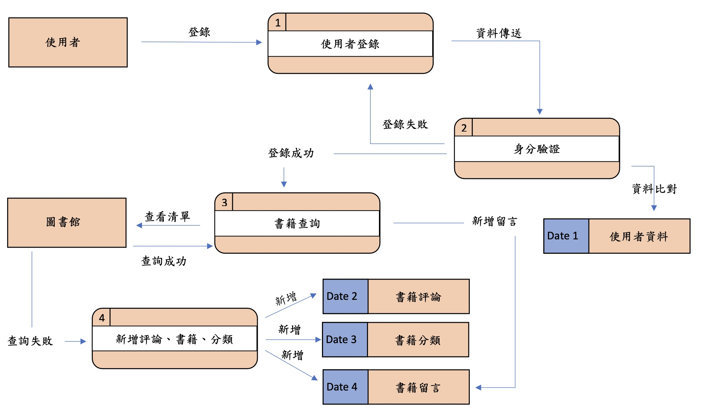
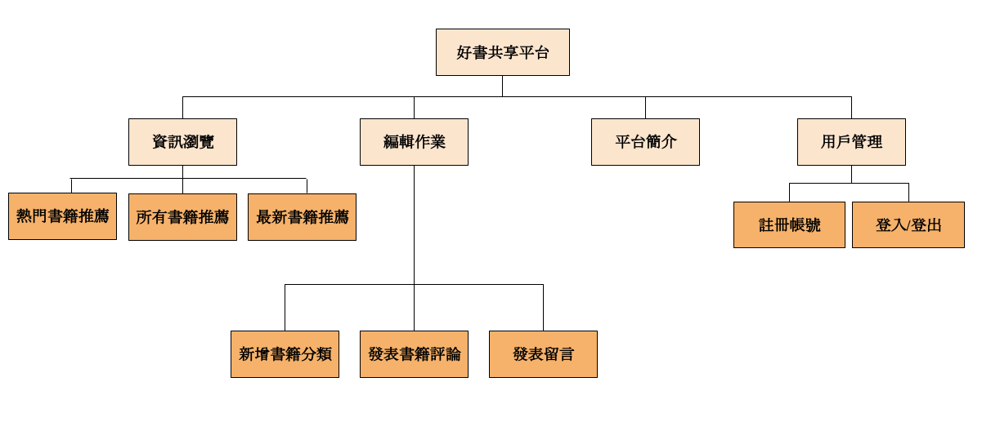
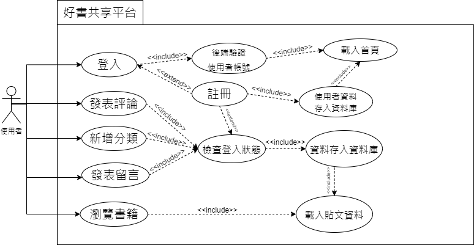
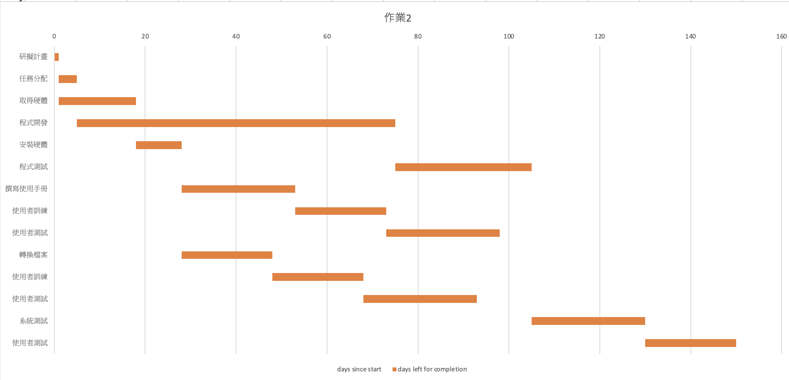
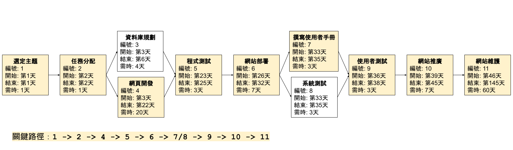

# 專案主題: 好書共享平台

# 組員
學號           | 姓名   
:-----------:|:-----:
0631039     | 徐惟厲
C108118201  | 楊筑鈞
C108133242  | 張文嫣
C108133314  | 簡鼎翰（組長）
C108190147  | 劉昌儒
B109118301  | 鄧穎琳

# 作業三

## DFD

## DFD 圖0

# 作業二

## 功能性需求
1. 註冊帳號
2. 發佈書籍推薦貼文
3. 新增書籍分類
4. 瀏覽所有推薦書籍及熱門書籍
5. 在書籍推薦貼文底下留言討論（可上傳圖片）
6. 關鍵字搜尋

## 非功能性需求
1. 使用性：使用者所需訓練時間少於30s。
2. 反應時間：使用者訪問頁面時，網頁在2s內渲染完成。
3. 維護性：遵循一般開發原則（參數命名達成共識），每段功能程式碼都加上註解，方便維護人員交接。
4. 可靠度：系統24/7在線，斷線機率小於0.1%。

## FDD

## 需求分析
1. 註冊帳號後，使用者才能發佈書籍推薦貼文及發表留言，否則只能瀏覽。
2. 使用者發佈書籍推薦貼文時，必須輸入書籍資訊（書名、作者、出版社、ISBN、分類標籤）及推薦內容，自動存入資料庫。
3. 使用者在現有書籍推薦貼文底下留言，可附加各種多媒體檔案。
4. 每日統計貼文訪問次數，經資料庫篩選，在網頁首頁顯示熱門推薦書籍。
5. 若使用者新增書籍分類標籤，以供其他使用者搜尋，避免重複。
6. 以書名為關鍵字搜尋資料庫，讓使用者快速找到感興趣的書籍推薦貼文。

## 使用案例圖

## 使用案例說明
### 第一例
| 使用案例名稱 | 登入 | 
| :---------: |:------------|
| 行動者 | 使用者 | 
| 說明 | 描述使用者點擊「登入」的過程 | 
| 完成動作 | 1. 使用者點擊「登入」   2. 輸入帳號及密碼 | 
| 替代方法 | 1. 使用者點擊「註冊」   2. 輸入使用者名稱、高科大信箱、密碼、確認密碼   3. 信箱驗證成功，完成註冊，自動登入 |  
| 先決條件 | 使用者必須先有帳號 |
| 後置條件 | 後端驗證成功，返回首頁 | 
| 假設 | 使用者都擁有高科大信箱 | 

### 第二例
| 使用案例名稱 | 發表書籍評論 | 
| :---------: |:------------|
| 行動者 | 使用者 | 
| 說明 | 描述使用者新增書籍資訊的過程 | 
| 完成動作 | 1. 使用者點選「編輯作業」按鈕  2. 點選「發表評論」按鈕  3. 輸入書籍名稱、ISBN13碼、作者、出版社  4. 選擇書籍分類  5. 上傳封面  6. 撰寫推薦內容並送出 | 
| 替代方法 | 1. 使用者點擊「註冊」   2. 輸入使用者名稱、高科大信箱、密碼、確認密碼   3. 信箱驗證成功，完成註冊，自動登入  4. 點擊「送出」完成發表  |  
| 先決條件 | 使用者必須完成登入 | 
| 後置條件 | 發表完成，轉向使用者剛發表的貼文頁面 | 
| 假設 | 使用者都擁有高科大信箱並已註冊完成帳號 | 

### 第三例
| 使用案例名稱 | 新增書籍分類 | 
| :---------: |:------------|
| 行動者 | 使用者 | 
| 說明 | 描述使用者新增書籍分類的過程 | 
| 完成動作 | 1. 使用者點選「編輯作業」按鈕  2. 點選「新增分類」按鈕  3. 輸入書籍分類名稱並送出 | 
| 替代方法 | 1. 使用者點擊「註冊」   2. 輸入使用者名稱、高科大信箱、密碼、確認密碼   3. 信箱驗證成功，完成註冊，自動登入  4. 點擊「新增書籍分類」和「送出」完成發表|
| 先決條件 | 使用者必須完成登入 | 
| 後置條件 | 新增成功後，即可看到剛新增的分類標籤 | 
| 假設 | 使用者都擁有高科大信箱並已註冊完成帳號 | 

### 第四例
| 使用案例名稱 | 發表留言 | 
| :---------: |:------------|
| 行動者 | 使用者 | 
| 說明 | 描述使用者在書籍推薦貼文底下留言的過程 | 
| 完成動作 | 1. 使用者點選感興趣的書籍推薦貼文    2. 點選「我要留言」區塊空白處  3. 輸入留言內容 | 
| 替代方法 | 1. 使用者點擊「註冊」   2. 輸入使用者名稱、高科大信箱、密碼、確認密碼   3. 信箱驗證成功，完成註冊，自動登入  4. 點擊「送出」完成留言  |  
| 先決條件 | 使用者必須完成登入，且已進入書籍推薦貼文頁面 | 
| 後置條件 | 留言完成，呈現使用者已留言的貼文頁面 | 
| 假設 | 使用者都擁有高科大信箱並已註冊完成帳號 | 

### 第五例
| 使用案例名稱 | 瀏覽所有書籍推薦 | 
| :---------: |:------------|
| 行動者 | 使用者 | 
| 說明 | 描述使用者瀏覽所有書籍推薦的過程 | 
| 完成動作 | 使用者點擊選單上「所有書籍推薦」按鈕 | 
| 替代方法 | 無 |  
| 先決條件 | 無 | 
| 後置條件 | 頁面呈現所有書籍推薦 | 
| 假設 | 無 |

# 作業一

## 內容

### 主要功能：
使用者藉由『好書共享平台』，發表閱讀過的書籍相關資訊，包括書名、作者、ISBN、出版社、以及書籍推薦心得，亦可在其它貼文下留言評論。

### 特色：
* 此系統與高科大圖書館的書籍推薦系統不同之處在於，後者為學生推薦書籍給校方後，校方用圖書經費預算添購書籍，增加圖書館書籍館藏。我們的系統則提供了書籍心得共享的平台，藉由發表推薦心得、留言討論等功能，使用者可以互相探討彼此的讀書心得，透過留言交流，激發彼此未深思構想之處。

* 根據已發表的書籍推薦心得，其他使用者便可事先了解感興趣的書籍的大致內容，精確選擇適合自己的書籍，而非僅憑書籍封面及廣告選擇書籍，淪落至花了時間讀完卻沒有收穫的窘境。
 
### 系統規劃：
預計使用Python 語言的Django 網站後端框架和前端基本HTML、CSS 和 jQuery等來構建。開發完成後，將開始部屬網站，預計使用 Amazon  AWS平台的EC2實體部屬 Apache 後端伺服器以及 mySQL資料庫。若時間允許，本組亦會嘗試製作 Android手機版本，實現雙平台的資料庫共通。

## 工作分解結構清單

編號    | 任務說明	   |需時（天）	|前置任務
:------:|:---------:|:--------:|:-----:
1	      | 選定主題	   | 1		  | -
2	      | 任務分配	   | 1		  | 1
3	      | 資料庫規劃	  | 4		   | 2
4	      | 網頁開發	   | 20		  | 2
5	      | 程式測試	   | 3		  | 3,4
6	      | 網站部屬	   | 7		  | 5
7	      | 撰寫使用手冊  | 3		   | 6
8	      | 系統測試	   | 3		   | 6
9	      | 使用者測試	  | 3		    | 7,8
10	    | 網站推廣	   | 7		   | 9
11	    | 網站維護	   | 60		   | 10

## 工作分配

工作內容       |  姓名   
:--------------:|:-----:
資料庫規劃    | 徐惟厲、簡鼎翰
網頁開發      | 張文嫣、楊筑鈞
文書處理及報告 | 劉昌儒
撰寫使用手冊   | 鄧穎琳
系統測試及維護 | 全員

  
## 甘特圖

## PERT/CPM圖

### 關鍵路徑
1 - 2 - 4 - 5 - 6 - 7/8 - 9 - 10 - 11
